# AbleFlow

> Professional Task Management & Operational Reliability Platform

AbleFlow is a production-grade fullstack application that combines the best of task management (inspired by Trello) with operational reliability monitoring (inspired by Betterstack). Built with modern web technologies and AI-first principles, it provides teams with comprehensive tools to manage projects while maintaining system health.

## Features

### Task Management
- **Kanban Board**: Drag-and-drop task management with four columns (Backlog, To Do, In Progress, Done)
- **AI Prioritizer**: Intelligent task prioritization based on content analysis
- **Task Metadata**: Priority levels, status tracking, tags, and rich descriptions
- **Real-time Updates**: Instant synchronization across all connected clients

### Operational Reliability
- **System Monitoring**: Real-time health dashboard with uptime and latency metrics
- **Service Health Tracking**: Monitor multiple services with operational status
- **Incident Response**: AI-powered incident detection and management
- **Pattern Analysis**: Automated detection of recurring issues

### Enterprise Features
- **Audit Logs**: Complete system activity tracking for compliance and debugging
- **Disaster Recovery**: Snapshot creation and restoration capabilities
- **Analytics Dashboard**: Comprehensive insights with charts and metrics
- **MCP Integration**: Ready for Model Context Protocol integration

## Tech Stack

### Frontend
- **Next.js 13**: React framework with App Router
- **TypeScript**: Type-safe development
- **Tailwind CSS**: Utility-first styling
- **shadcn/ui**: High-quality React components
- **Recharts**: Data visualization

### Backend
- **Supabase**: PostgreSQL database with real-time capabilities
- **Row Level Security**: Database-level security policies

### Testing & Quality
- **Vitest**: Fast unit testing framework
- **Zod**: Runtime type validation
- **Error Boundaries**: Robust error handling

## Architecture

### Directory Structure

```
ableflow/
├── app/                      # Next.js app directory
│   ├── page.tsx             # Project Board (Kanban)
│   ├── monitoring/          # System Monitoring dashboard
│   ├── incidents/           # Incident Response page
│   ├── audit-logs/          # Audit Logs & Disaster Recovery
│   ├── analytics/           # Analytics & Insights
│   └── layout.tsx           # Root layout with sidebar
├── components/              # Reusable UI components
│   ├── ui/                  # shadcn/ui components
│   ├── sidebar.tsx          # Navigation sidebar
│   ├── kanban-column.tsx    # Kanban column component
│   ├── task-card.tsx        # Task card component
│   └── task-dialog.tsx      # Task creation/editing dialog
├── lib/                     # Core utilities and logic
│   ├── types.ts             # TypeScript type definitions
│   ├── validation.ts        # Zod validation schemas
│   ├── supabase.ts          # Supabase client
│   ├── audit.ts             # Audit logging utilities
│   ├── ai-prioritizer.ts    # AI task prioritization
│   ├── incident-response.ts # Incident detection and handling
│   ├── disaster-recovery.ts # Snapshot and restore logic
│   └── __tests__/           # Unit tests
├── public/                  # Static assets
└── supabase/               # Database migrations (via Supabase MCP)
```

### Database Schema

The application uses a PostgreSQL database with the following tables:

- **tasks**: Task management with priority, status, and metadata
- **services**: Service health monitoring data
- **incidents**: Incident tracking with severity levels
- **audit_logs**: Complete system activity logging
- **snapshots**: System state snapshots for disaster recovery

All tables have Row Level Security (RLS) enabled with appropriate policies.

### AI-First Design

#### AI Prioritizer
The AI Prioritizer analyzes task titles and descriptions to suggest appropriate priority levels:
- **High Priority**: Security issues, production bugs, critical incidents
- **Medium Priority**: Features, improvements, standard updates
- **Low Priority**: Documentation, cleanup, minor tasks

#### Incident Response Agent
Automatically detects service degradation and:
- Creates incident records
- Analyzes patterns for recurring issues
- Provides recommendations for resolution

## Development

### Prerequisites
- Node.js 18+
- npm or yarn
- Supabase account

### Environment Variables

Create a `.env.local` file with the following variables (these are provided by the Supabase MCP integration):

```env
NEXT_PUBLIC_SUPABASE_URL=your_supabase_url
NEXT_PUBLIC_SUPABASE_ANON_KEY=your_supabase_anon_key
```

### Installation

```bash
# Install dependencies
npm install

# Run database migrations (automatic via Supabase MCP)
# Migrations are applied automatically on project initialization

# Start development server
npm run dev
```

### Available Scripts

```bash
npm run dev          # Start development server
npm run build        # Build for production
npm run start        # Start production server
npm run test         # Run tests with Vitest
npm run test:ui      # Run tests with UI
npm run test:coverage # Generate coverage report
npm run lint         # Run ESLint
npm run typecheck    # Run TypeScript type checking
```

## Testing

The application includes comprehensive test coverage using Vitest and Testing Library.

### Running Tests

```bash
# Run all tests
npm test

# Run tests in watch mode
npm test -- --watch

# Run tests with UI
npm run test:ui

# Generate coverage report
npm run test:coverage
```

### Test Structure

- **Unit Tests**: Located in `lib/__tests__/`
- **Validation Tests**: Testing Zod schemas for data integrity
- **AI Logic Tests**: Testing prioritization algorithms

## CI/CD & Release Process

### Branching Strategy

We follow a Git Flow inspired branching model:

- **main**: Production-ready code
- **develop**: Integration branch for features
- **feature/***: Feature development branches
- **hotfix/***: Emergency production fixes
- **release/***: Release preparation branches

### CI/CD Pipeline

#### Automated Checks
1. **Linting**: ESLint validation
2. **Type Checking**: TypeScript compilation
3. **Unit Tests**: Vitest test suite
4. **Build**: Production build verification

#### Deployment Flow

```mermaid
graph LR
    A[Feature Branch] --> B[Pull Request]
    B --> C[CI Checks]
    C --> D[Code Review]
    D --> E[Merge to Develop]
    E --> F[Integration Tests]
    F --> G[Release Branch]
    G --> H[Final QA]
    H --> I[Merge to Main]
    I --> J[Deploy to Production]
    J --> K[Post-Deploy Monitoring]
```



### Recommended CI Configuration (GitHub Actions)

```yaml
name: CI/CD Pipeline

on:
  push:
    branches: [main, develop]
  pull_request:
    branches: [main, develop]

jobs:
  test:
    runs-on: ubuntu-latest
    steps:
      - uses: actions/checkout@v3
      - uses: actions/setup-node@v3
        with:
          node-version: '18'
      - run: npm ci
      - run: npm run lint
      - run: npm run typecheck
      - run: npm test
      - run: npm run build

  deploy:
    needs: test
    if: github.ref == 'refs/heads/main'
    runs-on: ubuntu-latest
    steps:
      - uses: actions/checkout@v3
      - uses: actions/setup-node@v3
      - run: npm ci
      - run: npm run build
      - name: Deploy
        run: |
          # Deploy to your hosting platform
          echo "Deploying to production..."
```

## Monitoring & Observability

### Application Monitoring

The application includes built-in monitoring features:

1. **System Health Dashboard**: Real-time service status
2. **Incident Tracking**: Automated incident detection
3. **Audit Logs**: Complete activity trail
4. **Analytics**: Usage patterns and metrics

### Recommended External Monitoring

- **Error Tracking**: Sentry or similar
- **Performance Monitoring**: New Relic or Datadog
- **Uptime Monitoring**: Pingdom or UptimeRobot
- **Log Aggregation**: LogRocket or Papertrail

## Security

### Built-in Security Features

- **Row Level Security**: Database-level access control
- **Input Validation**: Zod schemas for all user input
- **SQL Injection Prevention**: Supabase parameterized queries
- **XSS Prevention**: React's built-in escaping

### Security Best Practices

1. Never commit environment variables
2. Use HTTPS in production
3. Regularly update dependencies
4. Monitor audit logs for suspicious activity
5. Implement rate limiting for API endpoints

## Disaster Recovery

### Snapshot Management

The application provides automated system state snapshots:

```typescript
// Create a snapshot
const snapshotId = await createSnapshot();

// Restore from a snapshot
await restoreSnapshot(snapshotId);
```

### Backup Strategy

1. **Automated Snapshots**: Create snapshots before major changes
2. **Retention Policy**: Keep snapshots for 30 days
3. **Off-site Backup**: Store snapshots in separate storage
4. **Testing**: Regularly test restore procedures

## MCP Integration

AbleFlow is designed to integrate with the Model Context Protocol (MCP) for enhanced AI capabilities:

- **Task Analysis**: Advanced natural language understanding
- **Predictive Analytics**: Forecast project timelines and risks
- **Automated Responses**: Intelligent incident resolution suggestions
- **Context-Aware Decisions**: AI-driven prioritization and routing

### MCP Integration Points

1. **Task Prioritization**: Enhanced AI models for better categorization
2. **Incident Detection**: Advanced pattern recognition
3. **Analytics**: Predictive modeling and forecasting
4. **Automation**: Intelligent workflow automation

## Contributing

We welcome contributions! Please follow these guidelines:

1. Fork the repository
2. Create a feature branch (`git checkout -b feature/amazing-feature`)
3. Commit your changes (`git commit -m 'Add amazing feature'`)
4. Push to the branch (`git push origin feature/amazing-feature`)
5. Open a Pull Request

### Code Standards

- Follow TypeScript best practices
- Write tests for new features
- Update documentation as needed
- Follow the existing code style

## Performance Optimization

### Implemented Optimizations

- **Code Splitting**: Next.js automatic code splitting
- **Image Optimization**: Next.js Image component
- **Caching**: Supabase client-side caching
- **Lazy Loading**: Dynamic imports for heavy components

### Performance Targets

- **First Contentful Paint**: < 1.5s
- **Time to Interactive**: < 3.5s
- **Lighthouse Score**: > 90

## License

This project is proprietary software. All rights reserved.

## Support

For support, please contact:
- Email: support@ableflow.com
- Documentation: https://docs.ableflow.com
- Issues: https://github.com/ableflow/ableflow/issues

---

Built with ❤️ by the AbleFlow team
